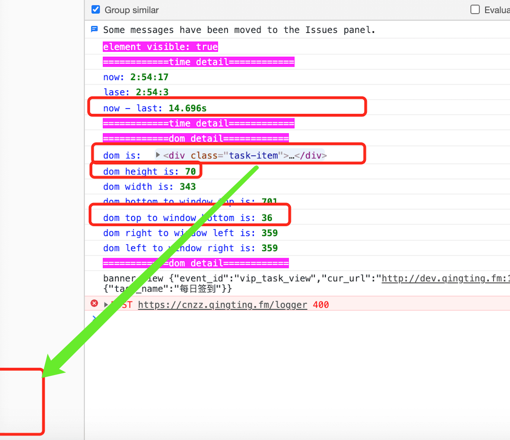

## 简介

日志曝光打点组件。曝光规则：

- 漏出页面50%，包括上下左右方向
- 一直停留在页面只会曝光一次
- 再次曝光需要离开可视区域后再次进入可视区域且时间间隔需要超过 seconds 秒
- 客户端点击返回也会曝光一次
- 支持列表曝光渲染，不会新增多余元素

## 如何开发

```bash
# 安装依赖
npm ci

# 发布前构建
npm run build

# 发布
npm publish
```

## 如何使用

```js
// == 安装:  
npm i ync-react-expose --save

// == 引用
import Expose from "ync-react-expose"

// == 调用
<Expose seconds={10} openDebugger={false} expose={() => {
    // == 调用打点事件
}}>
    <div>曝光主体<div>
</Expose>
```

## 参数描述

| 参数名 | 类型  | 是否必须 | 说明  |  默认值 |
| --- | --- | ---- | --- | --- |
| seconds | number | 否 | 曝光时间间隔 | 10 |
| expose | function | 否 | 曝光事件主体函数 | () => {} |
| openDebugger | boolean | 否 | 控制台是否输出曝光跟踪: <br>1、元素信息：包括当前元素宽高、距离可视区域上下左右距离<br>2、时间信息：当前时间、上次离开时间、时间间隔 | false |

## openDebugger 开启后详情如下


